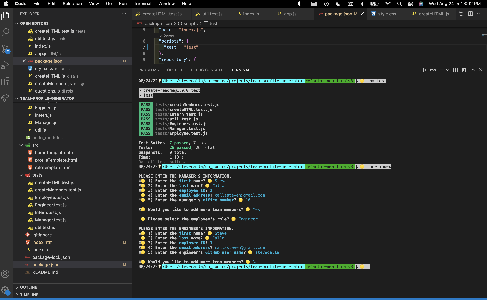

# TEAM PROFILE GENERATOR 
[](https://opensource.org/licenses/MIT)

## Index

1. [Description](#description)
2. [Installation](#installation)
3. [Usage](#usage)
4. [Features](#features)
5. [Future Enhancements](#future-enhancements)
6. [Contributing](#contributing)
7. [Resources](#resources)
8. [License](#license)

## Description

```
The app is a command-line interface to generate a webpage listing the members of a software engineering team. The team can use the page to gain quick access to information about team's mission and members including email address and GitHub profile. The team manager proceeds through a series of questions to describe each member including name, role/title, employee id along with role specific information such as office number for the manager, GithHub user name for the engineer(s) and current school for intern(s). The app will use this information to create a webpage. 
```

## Installation

(1) Fork the repo, (2) Clone the forked repo locally, (3) Run "npm install" (to install dependencies), (4) Run "node index.js" (from the root directory). To run Jest tests, run "npm test". Jest is setup to use a "--watcher" and provide "--coverage" statistics.

## Usage

This app creates a website which provides detailed information about a software engineering team from the command line.

## Features

This app includes features such as (a) a series of command line prompts to gather team member information, (b) validation for required information and email, default answers for image, modular breakdown of the code, use of inquirer to provide the questions including use of validation and filters (to format the answers). There code includes a robust set of Jest tests to make the code more maintainable.
<!-- 
1. TBD
2. TBD
3. TBD
-->
## Future Enhancements

This app can be enhanced by (a) creating the ability to add multiple teams with functionality to switch between teams on the webpage, (b) ability to add a team name and mission, (c) provide more or custom detail about each team member such as the ability to upload a photo, add pronouns, add fun facts, add a phone number and more, (d) the ability to add or delete team members (which can now be done but it's a complete re-build rather than amending the current team), (e) the abiility to modify team member information on the website or from the command line, (f) the ability to customize the page with team colors, icons or other team specific/brand details and (f) more.
<!-- 
1. TBD
2. TBD
3. TBD
-->

## App Preview - Static Screenshot


## App Preview - Video Preview



## Tests

To run Jest tests, run "npm test". Jest is setup to use a "--watcher" and provide "--coverage" statistics.

## Contributing

Contributor Covenant Code of Conduct

[](https://www.contributor-covenant.org/version/2/1/code_of_conduct/code_of_conduct.md)

<!-- DELETE THIS SECTION FOR THE FINAL README. For more information on example contribution guidelines please see the links below.

1. Contributor Convent: [Information](https://www.contributor-covenant.org/)
2. Contributor Covenant Code of Conduct: [Markdown File](hhttps://www.contributor-covenant.org/version/2/1/code_of_conduct/code_of_conduct.md)
-->

## Resources

1. Project Manager: [Steve Calla - GitHub Profile](https://github.com/stevecalla)
2. Contact: [Email Steve](mailto:callasteven@gmail.com)

## License 

[](https://opensource.org/licenses/MIT)
This project is licensed under the terms of the <span style="color:red">The MIT License</span>. Please click on the license badge for more information.

<!-- DELETE THIS SECTION FOR THE FINAL README. Per Github, you are under no obligation to choose a license. However, without a license, the default copyright laws apply, meaning that you retain all rights to your source code and no one may reproduce, distribute, or create derivative works from your work. If you're creating an open source project, we strongly encourage you to include an open source license. The Open Source Guide provides additional guidance on choosing the correct license for your project. SEE THE FOLLOWING LINKS FOR MORE INFORMATION:

1. GitHub: [Licensing a repository](https://docs.github.com/en/repositories/managing-your-repositorys-settings-and-features/customizing-your-repository/licensing-a-repository)
2. Open Source Guide: [To Choose A License](https://choosealicense.com/)
-->

<!-- OTHER SECTIONS IF YOU LIKE
## Technologies

1. HTML
2. CSS
3. JavaScript
4. GitHub (website hosting and source code management)
5. TBD
6. TBD

### 3rd Party Application Programming Interfaces

1. [TBD](https://TBD)
2. [TBD](https://TBD)
3. [TBD](https://TBD)

### Dependencies

1. [VS Code Live Server](https://ritwickdey.github.io/vscode-live-server/)

## Collaborators

1. FIRST & LAST NAME: [Github LINK](https://github.com/<Github user name>/)
2. FIRST & LAST NAME: [Github LINK](https://github.com/<Github user name>/)
3. FIRST & LAST NAME: [Github LINK](https://github.com/<Github user name>/)

## Resources

1. GitHub Repo: <https://github.com/tbd/tbd>
2. GitHub Hosted URL: <https://tbd.tbd.com/tbd>
-->
