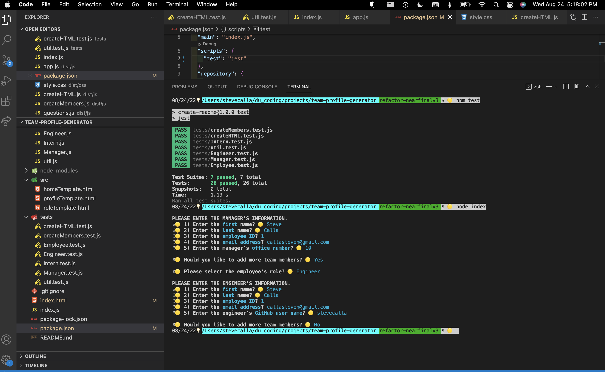

# File Mover for edX Course Content

## Index

1. [Description](#description)
2. [Installation](#installation)
3. [Usage](#usage)
4. [Features](#features)
5. [Future Enhancements](#future-enhancements)
6. [Contributing](#contributing)
7. [Resources](#resources)
8. [License](#license)

## Description

The app is a command-line interface to for edX instructional staff to move class content from the edX Instructor content directory to the related edX GitLab (or Github) Student repo. 

The user designates the path for the instructor Class Content and destination Student Content on their local environment as well as whether to delete all or specific Solved and Main files via a series of command prompt questions. 

As a result, the applicable folder structure and files will be copied from the Instructor content directory to the Student repo.

## Installation

(1) Fork the repo (to customize the repo). 
(2) Clone the forked repo locally. 
(3) Run "npm install" (to install dependencies). 
(4) Start the app (from the root directory):

    "node index.js"...  
    ...or "npm run start" 

(5) Run Jest Tests: "npm run test"

## Technologies

1. Node.js
2. JavaScript
3. GitHub (website hosting and source code management)
4. Inquirer NPM
5. Dotenv NPM

## Features

Command line interface to:

1. Allows user to input source & destination directory.
2. Reads the source directory. 
3. Allows user to selec the applicable content location in the source directory.
4. Makes a copy of content in the source directory and moves content to the destination directory.
5. Allows user to delete all or select Solved folders in the destination directory.
6. Allows user to delete all or select Main folders in the destination directory.

## App Preview - Static Screenshot

### Instructions Screenshot

### Copy & Delete Screenshot

## App Preview - Video Preview 
[Link to Video](https://www.youtube.com/watch?v=_hr9SKZC5Rc&feature=youtu.be)

## Tests

Jest is used for testing. Testing is setup for a limited number of functions. To run tests "npm run test".

## Contributing

Contributor Covenant Code of Conduct

<!-- DELETE THIS SECTION FOR THE FINAL README. For more information on example contribution guidelines please see the links below.

1. Contributor Convent: [Information](https://www.contributor-covenant.org/)
2. Contributor Covenant Code of Conduct: [Markdown File](hhttps://www.contributor-covenant.org/version/2/1/code_of_conduct/code_of_conduct.md)
-->

## Resources

1. GitHub Repo: <https://github.com/stevecalla/file-mover-edx>
2. Project Manager: [Steve Calla - GitHub Profile](https://github.com/stevecalla)
3. Contact: [Email Steve](mailto:callasteven@gmail.com)

## License 

This project is licensed under the terms of the The MIT License. Please click on the license badge for more information.

<!-- DELETE THIS SECTION FOR THE FINAL README. Per Github, you are under no obligation to choose a license. However, without a license, the default copyright laws apply, meaning that you retain all rights to your source code and no one may reproduce, distribute, or create derivative works from your work. If you're creating an open source project, we strongly encourage you to include an open source license. The Open Source Guide provides additional guidance on choosing the correct license for your project. SEE THE FOLLOWING LINKS FOR MORE INFORMATION:

1. GitHub: [Licensing a repository](https://docs.github.com/en/repositories/managing-your-repositorys-settings-and-features/customizing-your-repository/licensing-a-repository)
2. Open Source Guide: [To Choose A License](https://choosealicense.com/)
-->

<!-- OTHER SECTIONS IF YOU LIKE
## Technologies

1. HTML
2. CSS
3. JavaScript
4. GitHub (website hosting and source code management)
5. TBD
6. TBD

### 3rd Party Application Programming Interfaces

1. [TBD](https://TBD)
2. [TBD](https://TBD)
3. [TBD](https://TBD)

### Dependencies

1. [VS Code Live Server](https://ritwickdey.github.io/vscode-live-server/)

## Collaborators

1. FIRST & LAST NAME: [Github LINK](https://github.com/<Github user name>/)
2. FIRST & LAST NAME: [Github LINK](https://github.com/<Github user name>/)
3. FIRST & LAST NAME: [Github LINK](https://github.com/<Github user name>/)

## Resources

1. GitHub Repo: <https://github.com/tbd/tbd>
2. GitHub Hosted URL: <https://tbd.tbd.com/tbd>

## Future Enhancements

This app can be enhanced by (a) creating the ability to add multiple teams with functionality to switch between teams on the webpage, (b) ability to add a team name and mission, (c) provide more or custom detail about each team member such as the ability to upload a photo, add pronouns, add fun facts, add a phone number and more, (d) the ability to add or delete team members (which can now be done but it's a complete re-build rather than amending the current team), (e) the abiility to modify team member information on the website or from the command line, (f) the ability to customize the page with team colors, icons or other team specific/brand details and (f) more.
<!-- 
1. TBD
2. TBD
3. TBD
-->
